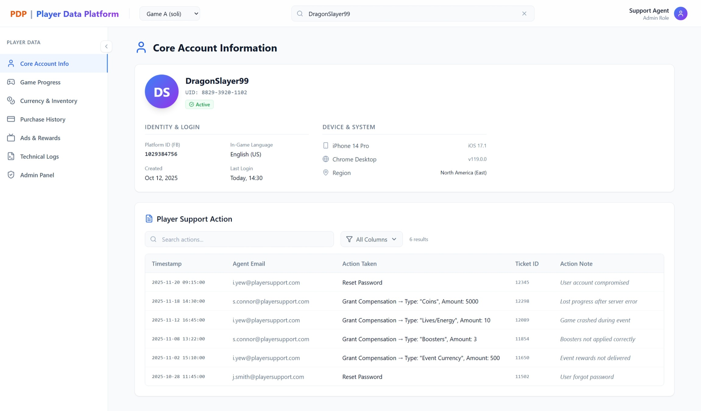
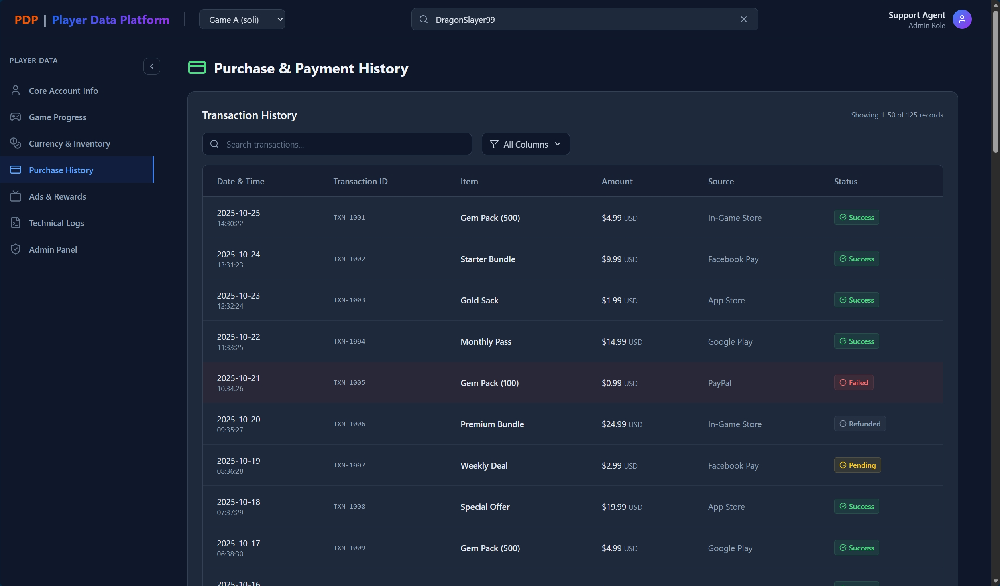

# Player Data Platform (PDP)

The **Player Data Platform (PDP)** is a streamlined internal web application built to empower player support teams. It consolidates player account information across multiple titles into a single, intuitive interface, enabling faster, smarter, and more effective support.

---

## Why PDP?

Resolving player enquiries often requires digging through scattered systems or relying on developer intervention. PDP eliminates that friction by giving support agents and team leads direct visibility into the data they need, without database queries or technical overhead.

With PDP, teams can:

- **Quickly identify players**: access account details, registration info, and status at a glance
- **Track progress across games**: view levels, milestones, and title-specific achievements
- **Review balances & inventory**: check soft/hard currency and owned items instantly
- **Audit purchases & payments**: trace transaction history and payment events with ease
- **Monitor ads & rewards**: confirm ad engagement and redemption activity
- **Troubleshoot issues**: leverage technical logs to diagnose and resolve reported problems

---

## Who Benefits?

- **Player Support Agents**: resolve tickets faster with immediate access to relevant data
- **Subject Matter Experts (SMEs)**: analyze player activity to provide deeper insights
- **Team Leads**: oversee cases with confidence, ensuring consistency and accuracy in support

---

## Built With

| Layer     | Technology      |
|-----------|-----------------|
| Framework | React 19 (Vite) |
| Styling   | Tailwind CSS v3 |
| Routing   | React Router v7 |
| Icons     | Lucide React    |

---

## Getting Started

```bash
# Install dependencies
npm install

# Start the development server
npm run dev
```

Access the app at `http://localhost:5173`.

---

## Authentication

PDP uses a simple login gate. No credentials are required, just use the demo account provided on the landing page to explore the platform.

---

## Important Notes

- All data shown is mock data, created to demonstrate the design and functionality of PDP.
- This is a prototype tool, serving as a foundation for future iterations and enhancements.

---

## UI Screenshots

**Account Info: Light Mode**


**Account Info: Dark Mode**


**Transaction History Tab**
